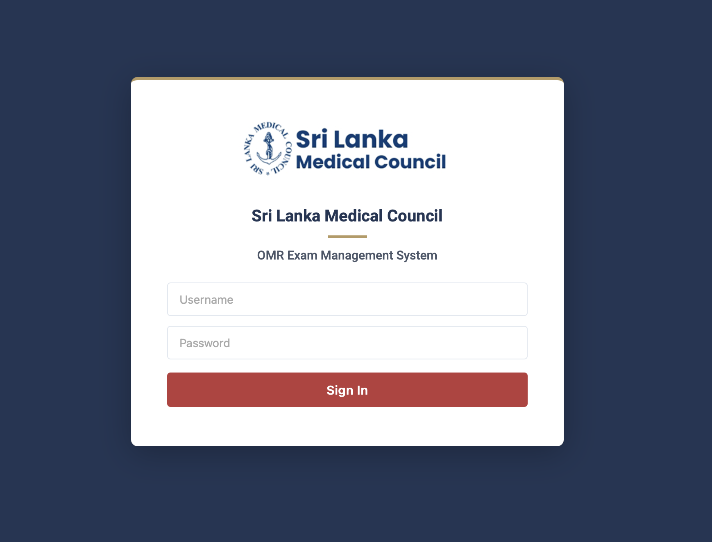
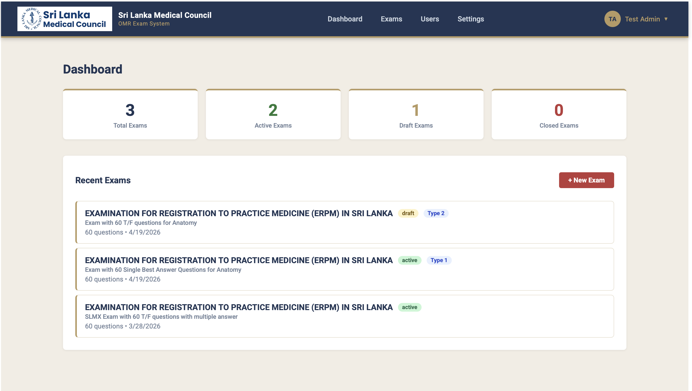
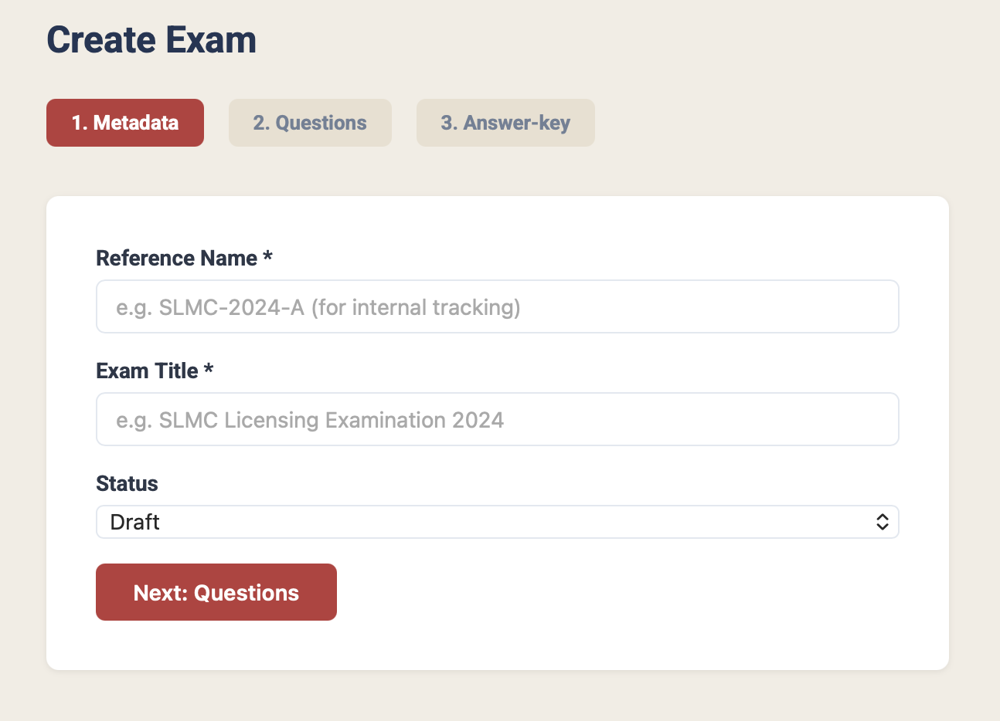
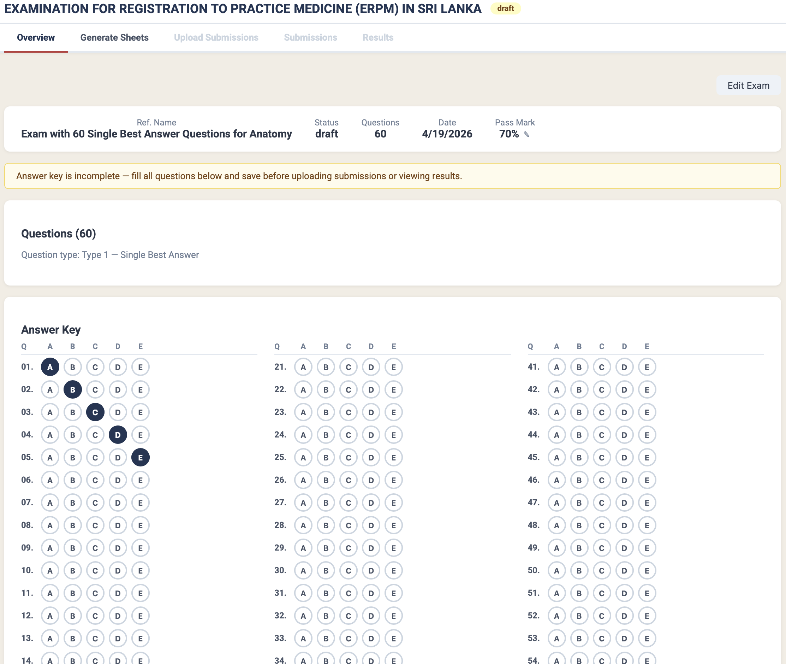
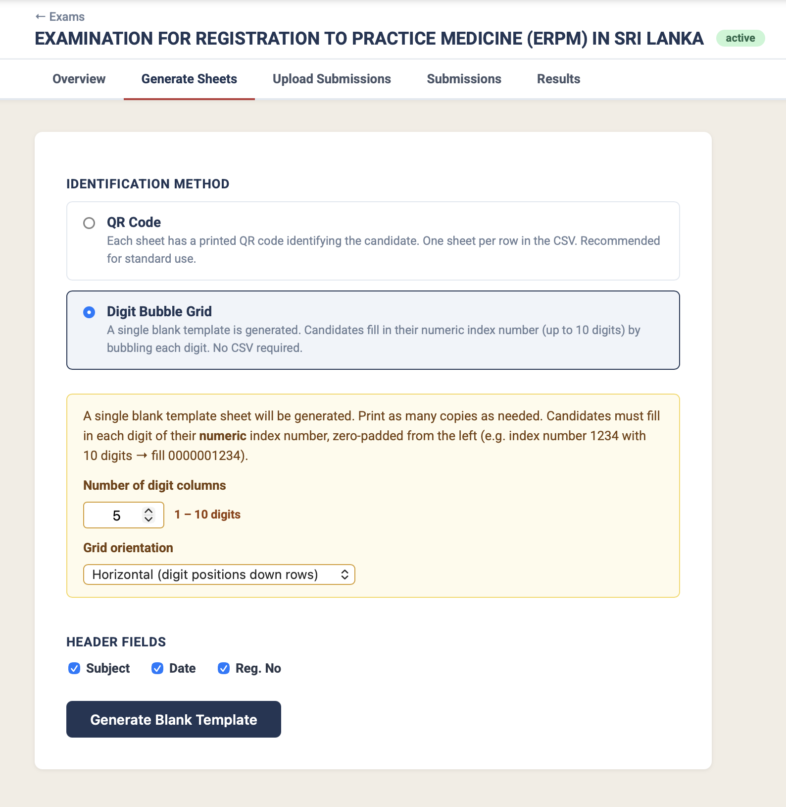
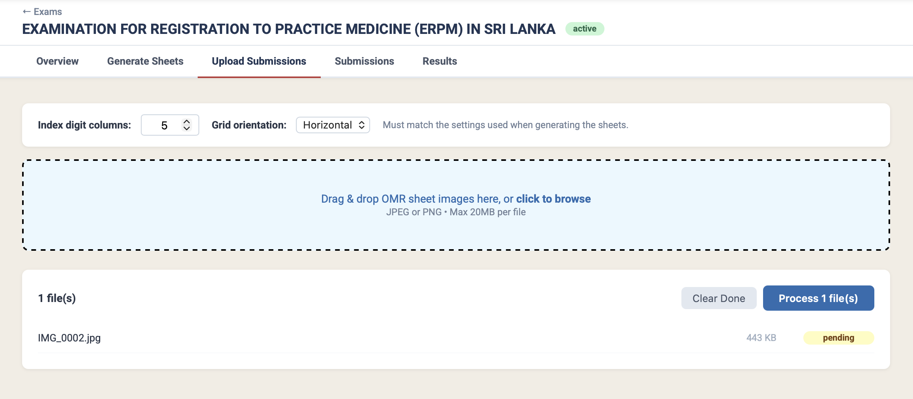
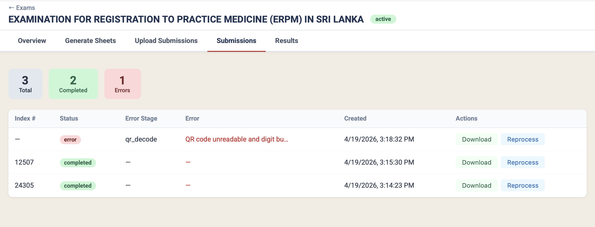
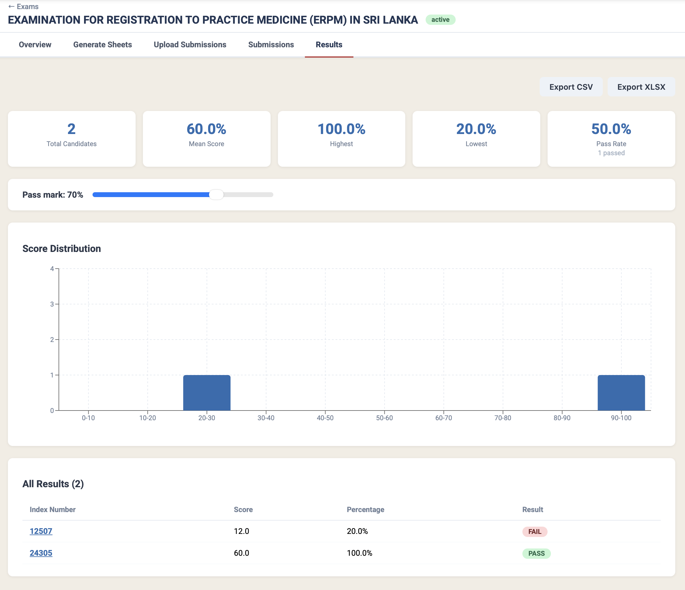
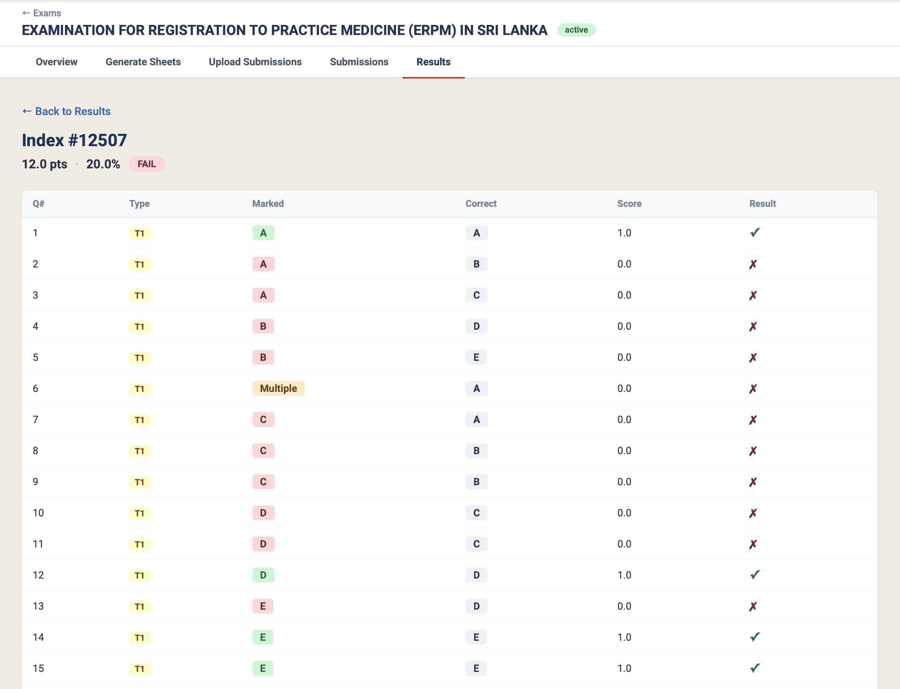

# SLMC OMR System — User Guide

Sri Lanka Medical Council Optical Mark Recognition (OMR) Examination Management System

---

## Table of Contents

1. [Overview](#overview)
2. [User Roles](#user-roles)
3. [Getting Started — Login](#getting-started--login)
4. [Dashboard](#dashboard)
5. [Creating an Exam](#creating-an-exam)
6. [Managing Answer Keys](#managing-answer-keys)
7. [Generating OMR Answer Sheets](#generating-omr-answer-sheets)
8. [Uploading Scanned Sheets](#uploading-scanned-sheets)
9. [Viewing Submissions](#viewing-submissions)
10. [Viewing Results](#viewing-results)
11. [OMR Answer Sheet Layout](#omr-answer-sheet-layout)
12. [Filling in the OMR Sheet (Candidate Instructions)](#filling-in-the-omr-sheet-candidate-instructions)

---

## Overview

The SLMC OMR System digitises the examination marking process for Sri Lanka Medical Council exams. Examiners create exams, generate answer sheets, scan the completed sheets after the exam, and obtain automated grading with per-candidate results and statistics.

**Two question types are supported:**

| Type | Format | Marking |
|------|--------|---------|
| Type 1 — Single Best Answer | Candidate fills **one** bubble (A–E) per question | 1 mark for correct answer; 0 if wrong, blank, or multiple filled |
| Type 2 — Extended True/False | Candidate marks **T or F** for each sub-option (A–E) per question | 0.2 marks per correct sub-option, max 1 mark per question |

---

## User Roles

Each account is assigned one or more roles that control what actions are available.

| Role | What they can do |
|------|-----------------|
| **Admin** | Full access — manage users, create and delete exams, upload, view results |
| **Creator** | Create and edit exams, set answer keys, generate sheets, upload submissions |
| **Marker** | Upload scanned sheets, reprocess submissions, view results |
| **Viewer** | Read-only — view submissions and results only |

Contact your administrator if you need a different level of access.

---

## Getting Started — Login

1. Open the application in your browser (default: `http://localhost:3000`).
2. Enter your **username** and **password** on the login page.
3. Click **Sign In**. After successful authentication you are taken to the Dashboard.



> First-time setup: the default administrator account is `admin` / `admin123`. Change the password immediately after first login via Settings.

---

## Dashboard

The Dashboard provides a summary of all exams and quick navigation.



- **Stat cards** at the top show counts by exam status: Total, Active, Draft, and Closed.
- **Recent Exams** list shows all exams with their status, question type, and question count.
- Click any exam row to open the Exam Detail page.
- Click **+ New Exam** (top right) to create a new exam.

---

## Creating an Exam

Click **+ New Exam** from the Dashboard or Exams page. Exam creation is a three-step wizard.



### Step 1 — Metadata

| Field | Description |
|-------|-------------|
| Reference Name | Short identifier used for internal tracking (e.g. `SLMC-2025-A`) |
| Exam Title | Full name of the examination, printed on the answer sheet |
| Status | Leave as **Draft** until the exam is ready |

Click **Next: Questions** to proceed.

### Step 2 — Questions

| Field | Description |
|-------|-------------|
| Question Type | **Type 1** (Single Best Answer) or **Type 2** (Extended True/False) — one type per exam |
| Number of Questions | Total question count |
| Pass Mark | Minimum percentage required to pass (default 50%) |

### Step 3 — Answer Key

Optionally enter the answer key during creation, or save it later from the Exam Detail page.

Click **Create Exam**. The exam is saved and you are taken to the Exam Detail page.

---

## Managing Answer Keys

Before sheets can be graded, the correct answers must be entered.



1. Open the Exam Detail page. The answer key is shown below the exam summary.
2. For each question, click the correct answer:
   - **Type 1**: Select A, B, C, D, or E. The selected bubble is highlighted.
   - **Type 2**: For each sub-option (A–E) select T (True) or F (False).
3. Click **Save Answer Key**.

> The answer key can be updated at any time. Reprocessing submissions after a change will re-grade them against the updated key.

---

## Generating OMR Answer Sheets

The system supports three sheet identification modes. Choose the mode that matches how your exam is set up.



### Sheet ID Modes

| Mode | How index number is encoded | CSV required |
|------|----------------------------|-------------|
| **QR Code** | QR code printed at top of sheet — one personalised sheet per candidate | Yes |
| **Digit Bubble Grid** | Candidate fills in their index number using a digit bubble grid | No — single blank template |
| **Both** | QR code (left) + bubble grid (right) — belt-and-braces approach | Yes |

### Steps

1. Open the Exam Detail page and click the **Generate Sheets** tab.
2. Select the **Identification Method**.
3. If using QR Code or Both mode, upload a CSV file with one index number per row (no header):
   ```
   2025/MED/001
   2025/MED/002
   2025/MED/003
   ```
4. Set **Number of digit columns** to match the length of your index numbers (used for the bubble grid; default 8).
5. Set **Grid orientation** (Horizontal or Vertical) — this must match the Upload settings later.
6. Click **Generate Blank Template** (Bubble Grid) or **Generate PDF** (QR/Both). Download and print — one A4 page per candidate, or one blank template for Bubble Grid mode.

> Print at exactly 100% scale. Do not scale to fit the page. Use a printer that produces sharp, high-contrast output.

---

## Uploading Scanned Sheets

After the examination, collect completed answer sheets and scan them.



### Scanning Requirements

- Resolution: **300 DPI minimum** (600 DPI recommended)
- Colour: Greyscale or colour (black-and-white is fine)
- Format: JPG or PNG per sheet
- All four corner alignment marks must be fully visible and not cropped

### Upload Steps

1. Open the Exam Detail page and click the **Upload Submissions** tab.
2. Set **Index digit columns** and **Grid orientation** to match the settings used when generating the sheets.
3. Drag and drop scanned files onto the upload area, or click **click to browse**. Multiple files can be added at once.
4. Click **Process files**. For each sheet the system will:
   - Detect alignment marks and correct perspective
   - Read the QR code (or detect the digit bubble grid) to identify the candidate
   - Detect filled bubbles
   - Grade against the saved answer key
5. Each file shows a status badge (Done / Error) and the detected index number once complete.

---

## Viewing Submissions

1. Open the Exam Detail page and click the **Submissions** tab.



2. The summary badges at the top show totals for Total, Completed, and Errors.
3. Each row shows:
   - **Index #** — detected candidate index number
   - **Status** — `completed`, `error`, or `pending`
   - **Error Stage / Error** — details if processing failed
   - **Created** — when the sheet was uploaded
4. **Actions** available per row (depending on your role):
   - **Download** — retrieves the original scanned image for inspection
   - **Reprocess** — re-runs the full OMR pipeline on the saved image using the original digit-grid settings. Use this after correcting an answer key, or if a sheet initially failed.

> Submissions with status **Error** could not be processed (e.g. QR unreadable, all four alignment marks not visible, no bubbles detected). Check the Error column, inspect the scanned image using Download, and use Reprocess once the issue is resolved.

---

## Viewing Results

1. Open the Exam Detail page and click the **Results** tab.



2. The results page shows:
   - **Summary cards** — total candidates, mean score, highest, lowest, pass rate
   - **Pass mark slider** — adjust the passing threshold; the breakdown updates in real time
   - **Score distribution chart** — bar chart showing candidates per 10% band
   - **All Results table** — index number, score, percentage, and pass/fail for every candidate
3. Click an index number to open the **per-candidate question breakdown**.



4. The detail view shows each question with:
   - **Marked** — the answer the candidate filled in (green = correct, red = wrong)
   - **Multiple** (orange badge) — candidate filled more than one bubble for a Type 1 question; scored as wrong
   - **Correct** — the expected answer from the answer key
   - **Score** and **Result** (✓ / ✗) per question
5. Click **Export CSV** or **Export XLSX** to download the full results table.

---

## OMR Answer Sheet Layout

### Header Area (top of page)

- SLMC logo and exam title / short name
- Candidate index number (if QR mode) and exam date
- **QR code** (top area) — do not cover, fold, or damage
- **Digit bubble grid** (top-right) — present in Digit Bubble Grid and Both modes

### Alignment Marks

Four solid black squares in the corners of the page. The system uses these to automatically correct sheet orientation and perspective. Do not mark over them.

### Section A — Type 1 Questions (Single Best Answer)

Questions are arranged in **three columns** across the page.

- Column headers show **A B C D E** above each column.
- Each row shows the question number followed by five bubbles.
- Candidate fills **one** bubble per row.
- Filling more than one bubble for the same question is recorded as **Multiple** and scored as **wrong**.

### Section B — Type 2 Questions (Extended True/False)

Questions are arranged in **four columns** across the page, with up to **15 questions per column**.

- Column headers show **A B C D E** above each column.
- Each question occupies a block of two rows: **T** (True) and **F** (False).
- Candidate fills one bubble in the T row and one in the F row for each sub-option.

### Footer

Instructions for candidates are printed at the bottom of the sheet.

---

## Filling in the OMR Sheet (Candidate Instructions)

> The following section is intended to be communicated to examination candidates.

1. **Use a black or dark blue ballpoint pen.** Do not use pencil or felt-tip markers.
2. **Fill bubbles completely and darkly.** The entire circle must be filled — partially filled bubbles may not be detected.
3. **One bubble per question (Section A / Type 1).** Filling more than one bubble for the same question will be marked as wrong — there is no way to recover a multiple-filled answer.
4. **If you change your answer (Type 1)**, cross out the incorrect bubble completely with a solid dark fill so it is indistinguishable from the correct one in darkness — or use correction fluid. Do not leave two visible bubbles.
5. **Two bubbles per sub-option (Section B / Type 2)** — one in the T row and one in the F row for each letter A–E.
6. **If using a Digit Bubble Grid sheet**, fill in each digit of your index number carefully in the grid at the top-right. Every digit column must have exactly one bubble filled.
7. **Do not make stray marks** anywhere on the sheet, especially near the bubbles, QR code, digit grid, or corner alignment marks.
8. **Do not fold, crease, or damage the sheet.** Damaged sheets may not be processable.

---

*For technical support, contact the SLMC ICT division.*
